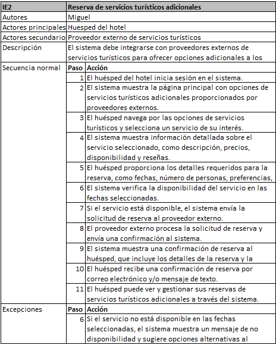

# Casos de uso

Este va dedicado a la siguiente historia de usuario:

_El sistema debe integrarse con proveedores externos de servicios turísticos para ofrecer opciones adicionales a los huéspedes_

## Diagrama

[Plantilla diagrama de caso de uso](Plantillas/Plantilla_diagrama_caso_de_uso.drawio)

## Caso de uso

[Plantilla caso de uso](Plantillas/Plantilla_casos_de_uso.xlsx)

